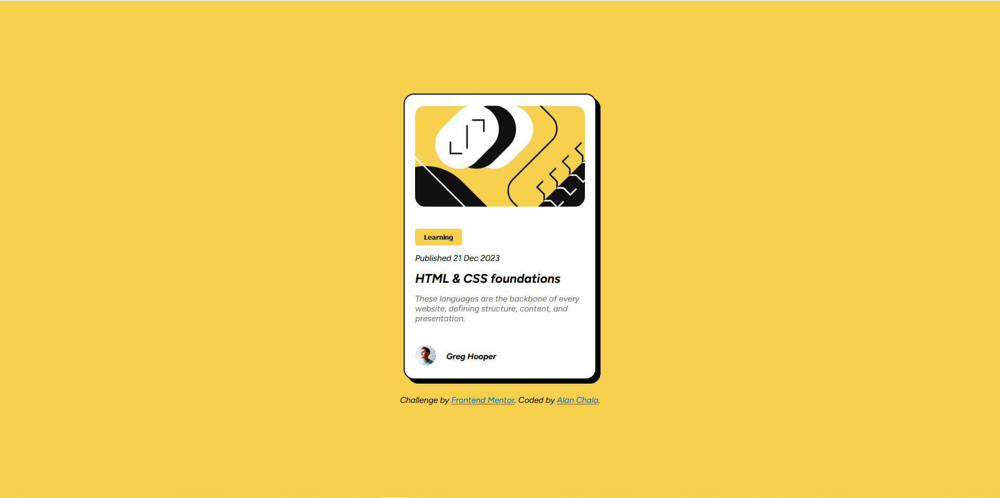

## Table of contents

- [Overview](#overview)
  - [Screenshot](#screenshot)
  - [Built with](#built-with)
- [Author](#author)

## Overview
--English--
A blog card is a visual summary of a blog post that is used to attract readers. It is like a small window into the content that appears on the main page of our blog, in search results or on social media.

--Spanish--
Una tarjeta de blog (blog card) es un resumen visual de una entrada de blog que se utiliza para atraer lectores. Es como una pequeña ventana al contenido que aparece en la página principal de nuestro blog, en resultados de búsqueda o en redes sociales.

### Screenshot

### Built with
- Semantic HTML5 markup
- CSS custom properties
- Flexbox
- Mobile-first workflow

## Author
- Website - [Add your name here](https://www.your-site.com)
- Frontend Mentor - [@AlanChala12](https://www.frontendmentor.io/profile/AlanChala12)