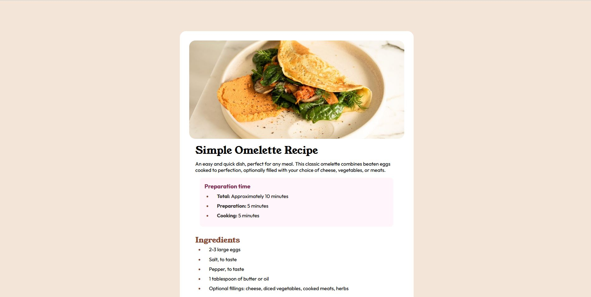

## Table of contents

- [Overview](#overview)
  - [Screenshot](#screenshot)
  - [Built with](#built-with)
- [Author](#author)

## Overview

--English--
This repository contains a simple HTML and CSS implementation of a recipe page for an omelette. It serves as a basic example of HTML structure, CSS styling for text, lists, and images, and responsive design considerations. Ideal for learning or quick prototyping.

--Spanish--
Este repositorio contiene una implementación sencilla en HTML y CSS de una página de recetas para un omelette. Sirve como un ejemplo básico de la estructura HTML, estilos CSS para texto, listas e imágenes, y consideraciones de diseño responsivo. Ideal para aprendizaje o prototipado rápido.

### Screenshot

### Built with

- HTML
-CSS

## Author

- Frontend Mentor - [@AlanChala12](https://www.frontendmentor.io/profile/AlanChala12)