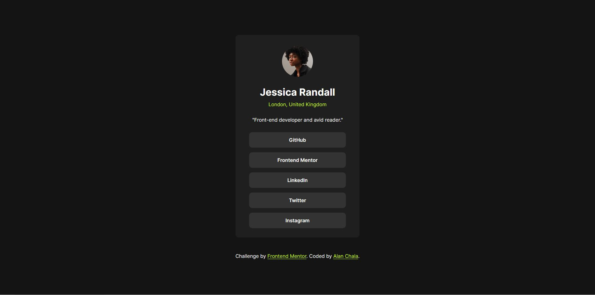

## Table of contents

- [Overview](#overview)
  - [Screenshot](#screenshot)
  - [Built with](#built-with)
- [Author](#author)

## Overview

--English--
A social links profile, also known as a "social links profile" or "links page," is a simple web page that gathers all of your important links from social networks and other websites in one place.

--Spanish--
Un perfil de enlaces sociales, también conocido como "social links profile" o "página de enlaces", es una página web sencilla que reúne todos tus enlaces importantes de redes sociales y otros sitios web en un solo lugar.

### Screenshot

### Built with

- Semantic HTML5 markup
- CSS custom properties
- Flexbox

## Author

- Frontend Mentor - [@AlanChala12](https://www.frontendmentor.io/profile/AlanChala12)